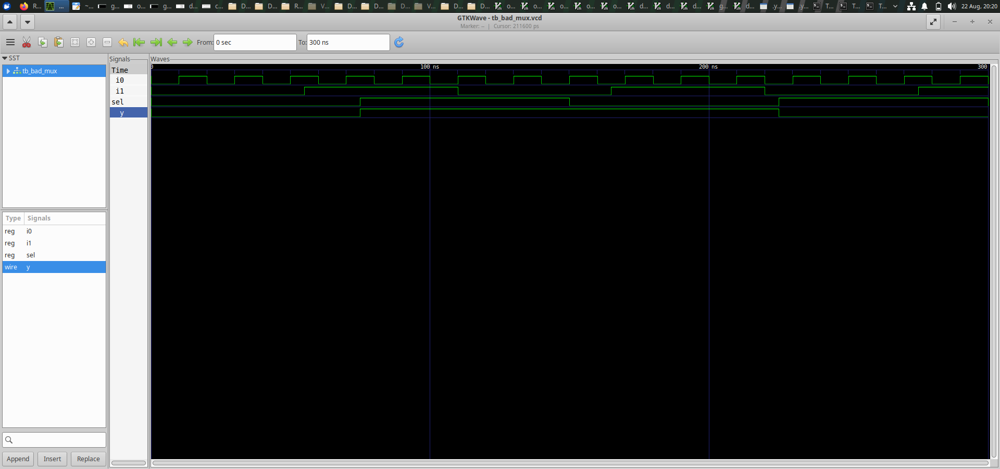
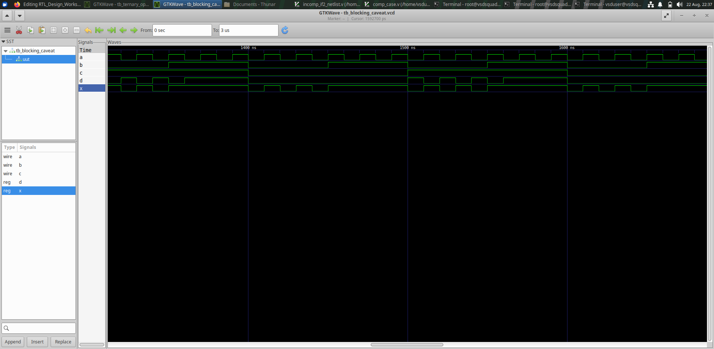
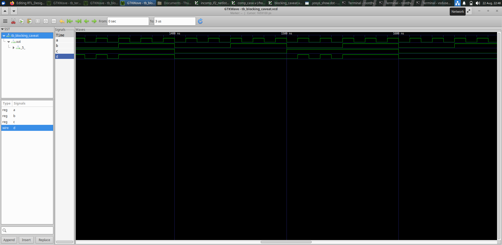
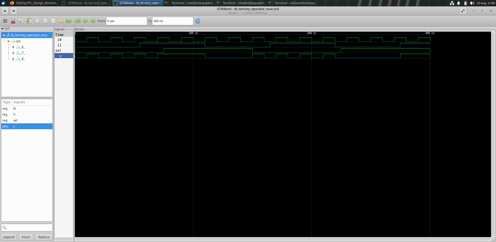
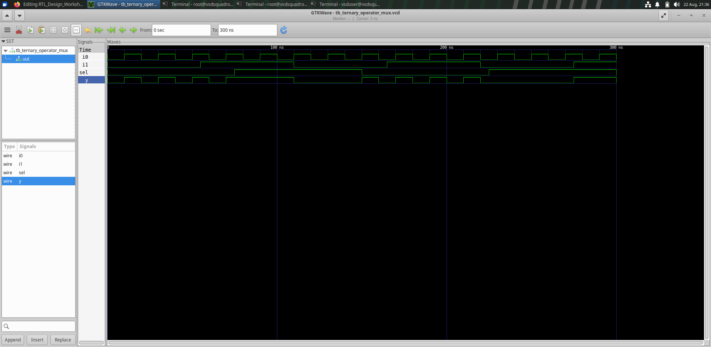
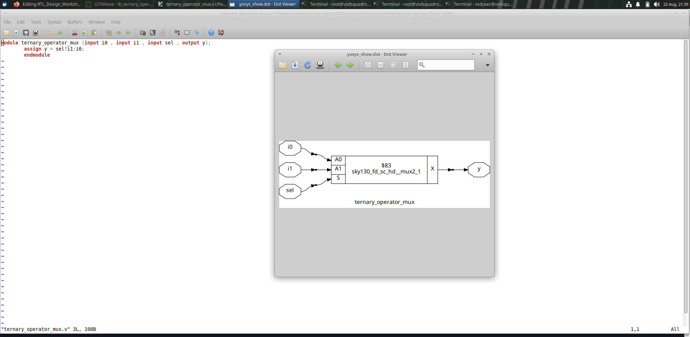

# Day 4 - RTL Coding Styles and Multiplexer Design

Day 4 focuses on understanding different RTL coding styles
and how they affect the behavior and synthesis of digital
circuits.

In this session, I worked with a 2:1 multiplexer, blocking
assignment behavior, and a multiplexer implemented using
the ternary operator.

The designs were simulated using Verilog and the results
were observed using GTKWave. The RTL designs were also
synthesized using Yosys to understand their hardware
implementation.

---

# Index

1. [Objective](#1-objective)
2. [Bad MUX](#2-bad-mux)
3. [Blocking Caveat](#3-blocking-caveat)
4. [Ternary Operator MUX](#4-ternary-operator-mux)
5. [Overall Learning](#5-overall-learning)
6. [Conclusion](#6-conclusion)

---

# 1. Objective

The main objective of Day 4 was to understand how different
Verilog RTL coding styles represent combinational hardware
and how synthesis tools interpret these descriptions.

The main concepts covered were:

- 2:1 Multiplexer
- RTL coding styles
- Blocking assignments
- Ternary operator
- Combinational logic
- RTL simulation
- Gate-level simulation
- Yosys synthesis
- GTKWave waveform analysis
- RTL and synthesized netlist comparison

---

# 2. Bad MUX

## What I designed

In this experiment, I worked with a simple 2:1 multiplexer
using Verilog RTL.

A multiplexer is a combinational circuit that selects one
of two input signals based on a select signal.

The main signals are:

- `i0` - First input
- `i1` - Second input
- `sel` - Select signal
- `y` - Output

The basic operation is:

- When `sel = 0`, the output follows `i0`.
- When `sel = 1`, the output follows `i1`.

The purpose of this experiment was to understand how the
RTL description of a MUX behaves during simulation and how
the synthesis tool converts it into hardware.

## RTL Design

The RTL representation of the bad MUX design is shown below.

## Simulation

The MUX was simulated by applying different combinations
of input and select signals.

The waveform was used to verify whether the output follows
the selected input.

## Synthesis

The design was synthesized using Yosys.

Yosys analyzed the RTL description and converted it into a
hardware-level representation.

The synthesized result shows the multiplexer cell used to
implement the required functionality.

## Result

This experiment helped me understand how a multiplexer can
be described using RTL and how the synthesis tool maps the
RTL description into actual hardware logic.

---

# 3. Blocking Caveat

## What I designed

In this experiment, I studied the behavior of blocking
assignments in Verilog.

Blocking assignments use the `=` operator and are executed
in the order in which they appear inside a procedural block.

Therefore, the order of statements can affect the values
used by subsequent statements.

This is especially important when writing combinational
logic using procedural blocks.

## Simulation

The design was simulated to observe the behavior of the
signals and output.

The waveform helps us understand how the input values are
processed according to the sequence of blocking assignments.

## Synthesis

The design was synthesized using Yosys.

The synthesis process converts the RTL description into
a hardware representation.

The synthesized result can be compared with the RTL
description to understand how the coding style is converted
into combinational hardware.

## Netlist and Block Diagram

The generated netlist and block diagram provide a hardware
level view of the design.

## Result

This experiment helped me understand that blocking
assignments are executed sequentially and that their order
can influence the behavior of procedural RTL.

It also showed how Yosys converts the RTL description into
the corresponding hardware implementation.

---

# 4. Ternary Operator MUX

## What I designed

In this experiment, I implemented a 2:1 multiplexer using
the Verilog ternary operator.

The ternary operator provides a simple and compact way to
describe conditional logic.

The basic expression for the MUX is:

`y = sel ? i1 : i0;`

This means:

- If `sel = 0`, `i0` is selected.
- If `sel = 1`, `i1` is selected.

The main signals are:

- `i0` - First input
- `i1` - Second input
- `sel` - Select signal
- `y` - Output

## RTL Simulation

The ternary operator MUX was simulated using the Verilog
simulation flow.

Different input and select combinations were applied and
the output waveform was observed.

## Synthesis

The design was synthesized using Yosys.

Yosys recognizes the conditional expression and converts it
into the corresponding multiplexer hardware.

## Netlist and Block Diagram

The synthesized netlist and block diagram show how the
ternary operator is represented as hardware.

## Result

This experiment demonstrated that the ternary operator can
be used as a compact way to describe a multiplexer.

It also showed that the synthesis tool can identify the
intended MUX functionality and generate the appropriate
hardware implementation.

---

# 5. Overall Learning

Through the experiments performed on Day 4, I understood
the following concepts:

- Working principle of a 2:1 multiplexer.
- How a MUX can be described using Verilog RTL.
- How the select signal controls the MUX output.
- Behavior of blocking assignments.
- Importance of statement ordering in procedural RTL.
- Use of the ternary operator for conditional logic.
- Simulation of RTL designs using GTKWave.
- Gate-level representation of RTL designs.
- Synthesis of Verilog designs using Yosys.
- Generation and analysis of synthesized netlists.
- Relationship between RTL code and hardware implementation.
- Importance of writing proper RTL coding styles.

---

# 6. Conclusion

Day 4 helped me understand different RTL coding styles and
their relationship with synthesized hardware.

I worked with a 2:1 multiplexer, blocking assignments, and
a ternary-operator based multiplexer.

By observing the RTL simulations, waveforms, netlists, and
synthesis results, I understood how Verilog RTL descriptions
are converted into combinational hardware.

These experiments also helped me understand the importance
of using suitable RTL coding styles for reliable and
efficient digital circuit design.
