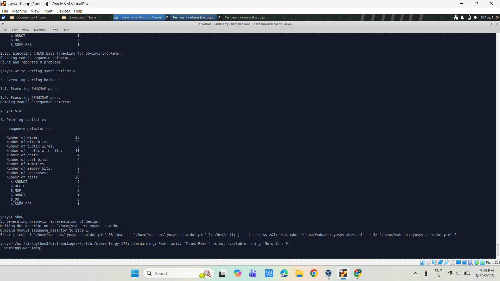
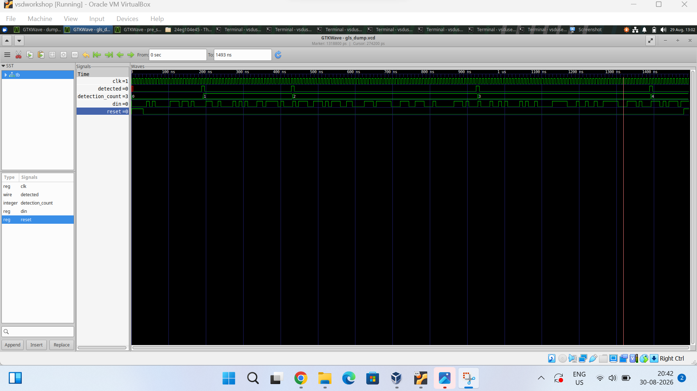

# RTL Design Workshop – Day 7

## Sequence Detector – RTL Simulation, Synthesis and Gate-Level Simulation

---

## Index

1. Introduction
2. Objective
3. Sequence Detector Design
4. RTL Simulation
5. Synthesis and Statistics
6. Synthesized Netlist
7. Gate-Level Simulation
8. RTL vs GLS
9. Conclusion

---

## 1. Introduction

Day 7 focuses on the complete RTL-to-Gate-Level Simulation (GLS) flow of a sequence detector. The design is verified at RTL level, synthesized using Yosys, and the synthesized netlist is verified using gate-level simulation.

---

## 2. Objective

- Verify the sequence detector at RTL level.
- Synthesize the RTL design using Yosys.
- Analyze the synthesized cell statistics.
- View the synthesized netlist.
- Perform Gate-Level Simulation (GLS).
- Compare RTL and GLS waveforms.

---

## 3. Sequence Detector Design

The design is a 7-bit sequence detector implemented using a Finite State Machine (FSM).

The detector receives the serial input `din` along with `clk` and `reset`. When the required sequence is detected, the `detected` output becomes active and the detection count is updated.

---

## 4. RTL Simulation

The RTL design was simulated before synthesis to verify its functional behavior.

### RTL Waveform

The waveform shows the clock, input `din`, reset, `detected` output and detection count. The detector produces the expected detection events for the applied input sequence.

---

## 5. Synthesis and Statistics

The RTL design was synthesized using Yosys.

The synthesis statistics obtained are:

- Number of wires: 24
- Number of wire bits: 30
- Number of public wires: 5
- Number of public wire bits: 11
- Number of ports: 4
- Number of port bits: 4
- Number of memories: 0
- Number of memory bits: 0
- Number of processes: 0
- Total number of cells: 27

### Cell Information

- `$ANDNOT_` : 9
- `$DFF_P_` : 7
- `$NOR_` : 2
- `$NOT_` : 1
- `$ORNOT_` : 1
- `$OR_` : 6
- `$SDFF_PP0_` : 1

### Synthesis Statistics

---

## 6. Synthesized Netlist

The synthesized netlist represents the RTL design using logic cells and flip-flops.

The design contains 7 D flip-flop cells and one resettable flip-flop cell, along with combinational logic gates.

### Synthesized Netlist

---

## 7. Gate-Level Simulation

After synthesis, the generated gate-level netlist was simulated using the same testbench.

### GLS Waveform

The GLS waveform shows the functional behavior of the synthesized sequence detector.

---

## 8. RTL vs GLS

The RTL and GLS waveforms were compared using the same input stimulus.

The detection events and detection count occur at the expected clock cycles. The GLS waveform may show small propagation delays due to the synthesized gate-level logic.

The logical detection sequence remains the same in both RTL and GLS simulations.

---

## 9. Conclusion

The sequence detector was successfully synthesized using Yosys and verified through Gate-Level Simulation. The RTL and GLS waveforms show the same functional detection behavior, confirming that the synthesized implementation preserves the functional behavior of the original RTL design.

---

## Files

- `README.md`
- `sequence_detector_blockdiagram.png`
- `sequence_detector_gls_waveforms.png`
- `sequence_detector_rtl waveform.png`
- `sequence_detector_stats.png`

---

## Tools Used

- Verilog HDL
- Yosys
- GTKWave
- Linux/Ubuntu
